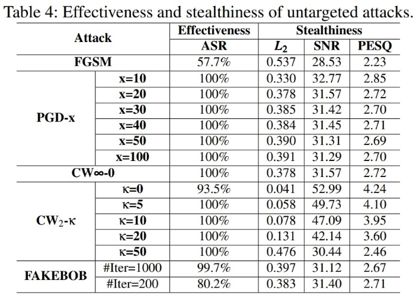
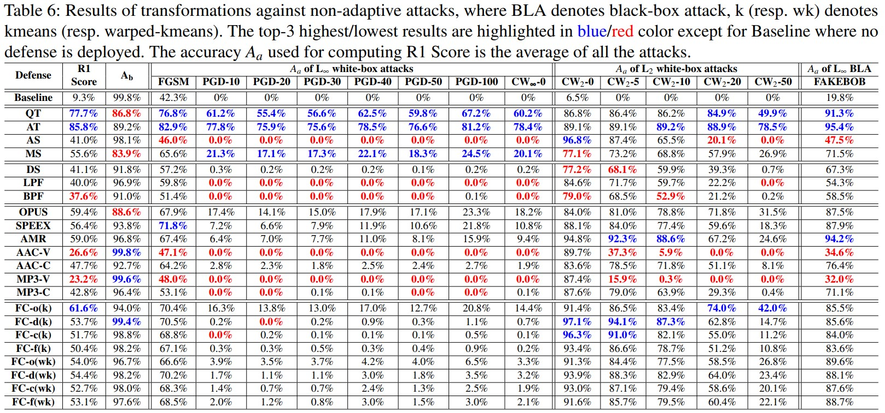
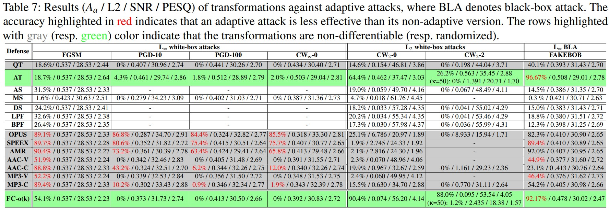
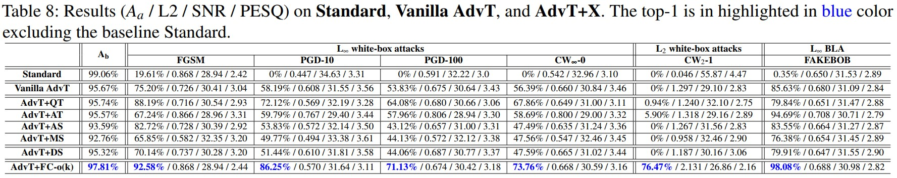

<!-- # SEC4SR
## A SECurity analysis platform for Speaker Recognition
### under construction. stay tuned! :)  -->

# About
Adversarial attack against machine learning models has attracted intensive attention over the past few years. It has been expanded to speaker recognition (SR). However, there is still a lack of quantitative understanding about the strengths and limitations of adversarial attacks and defenses in SR since:

- existing attacks are often assessed using different SR models, recognition tasks and datasets, 

- only few adversarial defenses borrowed from computer vision are considered,

- these defenses have not been thoroughly evaluated against adaptive attacks,

- More effective defenses are also required for securing SR systems.

SEC4SR is developed to bridge this gap by enabling researchers to systematically and comprehensively evaluate adversarial attacks and defenses in SR.

Compared with existing platforms, such as ART, ARES and DEEPSEC, SEC4SR is dedicated for speaker recognition by incorporating speech dedicated defenses and etc.

# Overview
SEC4SR is designed to be modular, flexible and extensible so that new models, datasets, attacks and defenses can be easily integrated. It consists of five components, namely, Model Component (MC), Dataset Component (DAC), Attack Component (AC), Defense Component (DEC) and Adaptive Attack Component (AAC).

<!--  --> 

    
     
    
Overview of SEC4SR

## MC 
MC contains three state-of-the-art embedding-based speaker recognition models, i.e., ivector-PLDA, xvector-PLDA and AudioNet. Xvector-PLDA and AudioNet are based on neural networks while ivector-PLDA on statistic model (i.e Gaussian Mixture Model).

The flexibility and extensibility of SEC4SR make it easy to add new models. Just wrap the model as `torch.nn.Module` and implement `make_decision` abstract method. See `model/Model.py` for detail.

## DAC
We provide five datasets, namely, Spk10_enroll, Spk10_test, Spk10_imposter, Spk251_train and Spk_251_test. They cover all the recognition tasks (i.e., CSI-E, CSI-NE, SV and OSI). The code will download them automatically. You can also manually download them using the follwing links:

[Spk10_enroll, 18MB, MD5:0e90fb00b69989c0dde252a585cead85](https://drive.google.com/uc?id=1BBAo64JOahk0F3yBAovnRLZ1NvjwBy7y&export\=download)

[Spk10_test, 114MB, MD5:b0f8eb0db3d2eca567810151acf13f16](https://drive.google.com/uc?id=1WctqJtP5Es74-U7y3cFXqfHi7JkDz6g5&export\=download)

[Spk10_imposter, 212MB, MD5:42abd80e27b78983a13b74e44a67be65](https://drive.google.com/uc?id=1f1GULs0aj_Xrw8JRxe6zzvTN3r2nnOf6&export\=download)

[Spk251_train, 10GB, MD5:02bee7caf460072a6fc22e3666ac2187](https://drive.google.com/uc?id=1EytvKVbrPszsRJpwChXHaPtlyIHow4hD&export\=download)

[Spk251_test, 1GB, MD5:182dd6b17f8bcfed7a998e1597828ed6](https://drive.google.com/uc?id=1iGcMPiPMzcCLI7xKJLwH1L0Ff_95-tmB&export\=download)

To add new datasets, one just need to define a class inheriting from `torch.utils.data.Dataset`, just like `dataset/Dataset.py`.

## AC
SEC4SR currently incorporate four white-box attacks (FGSM, PGD, CW$_\infty$ and CW$_2$) and two black-box attacks (FAKEBOB and SirenAttack). To incorporate new attack algorithms, one just need to inhert from the class in `attack/Attack.py` and implement the abstract method `attack`. See `attack/Attack.py` for detail.

## DEC
To secure SRSs from adversarial attack, SEC4SR provides 2 robust training methods (FGSM and PGD adversarial training) and 22 speech/speaker-dedicated input transformation methods, including our feature-level approach FEATURE COMPRESSION. All input transformation methods are implemented as standalone python functions, making it easy to extend this methods.

## ADAC
To suport adaptive attacks, SEC4SR incorporate three techniques, i.e., BPDA, EOT and NES. BPDA (resp. EOT) is used to circumvent non-differentiable (randmized) defenses. NES can be exploited to estimate the gradient in black-box setting.

All these techniques are as standalone wrappers so that they can be easily plugged into attacks to mount adaptive attacks.

# Empirical Study
Using SEC4SR, we perform the largest-scale empirical study on adversarial attacks and defenses in SR, involving 23 defenses, 15 attacks, and 4 attack settings. Our study provides lots of useful insights and findings that may advance research on adversarial examples in SR and assist the maintainers of SRSs to deploy proper defense solutions to enhance their systems. The main results are shown below:

## Weakness of SRSs under adversarial attacks

    
     
    <!-- 
Overview of SEC4SR
 -->

## Defense under non-adaptive attacks

    
     
    <!-- 
Overview of SEC4SR
 -->

## Defense under adaptive attacks

    
     
    <!-- 
Overview of SEC4SR
 -->

## Combination of transformation with adversarial training

    
     
    <!-- 
Overview of SEC4SR
 -->

# Code & Contributions
The source code of SEC4SR is available at [Code of SEC4SR](https://github.com/SEC4SR/SEC4SR).

New models, datasets, attacks and defenses are strongly welcome to be integrated into SEC4SR. If you want to do so, you can make a pull request or contant us (email address not available for anonymous submissions).

