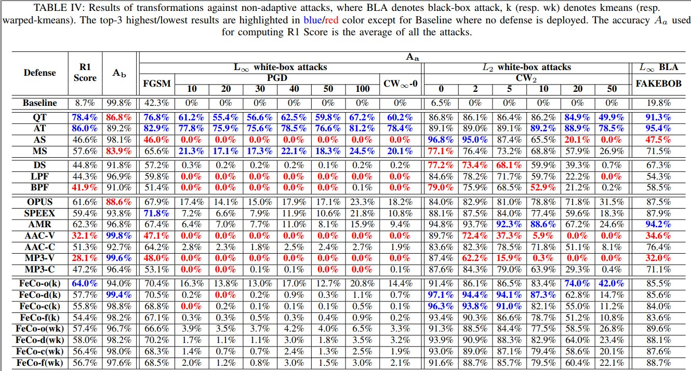
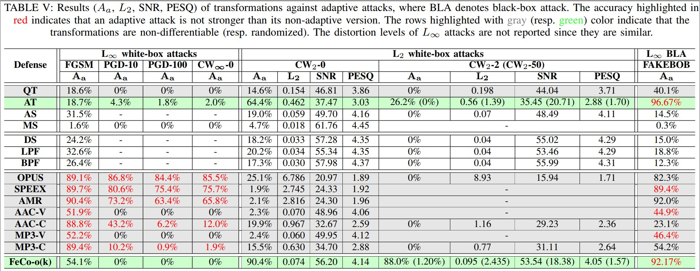
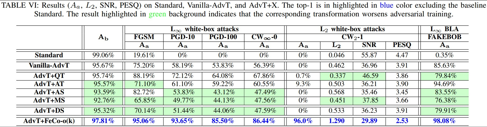
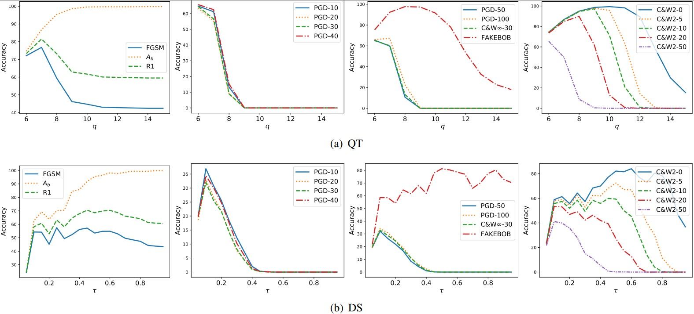
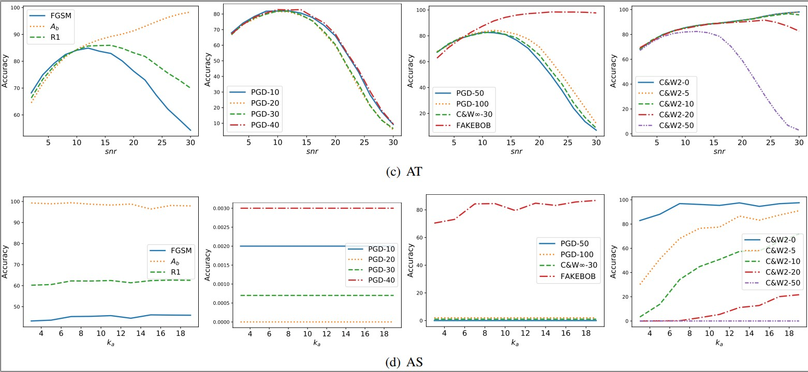
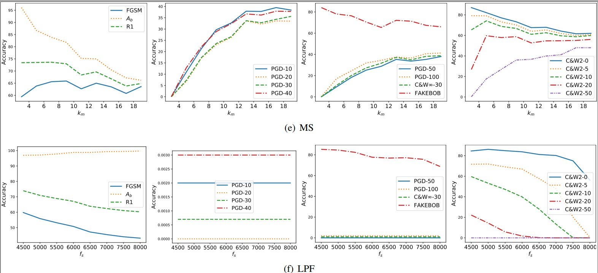
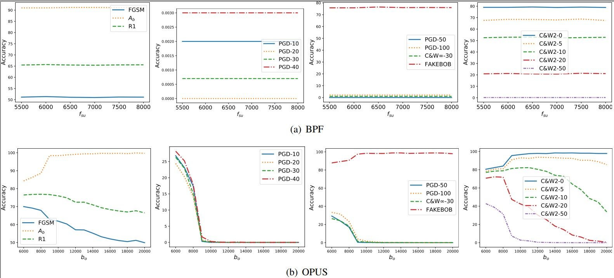
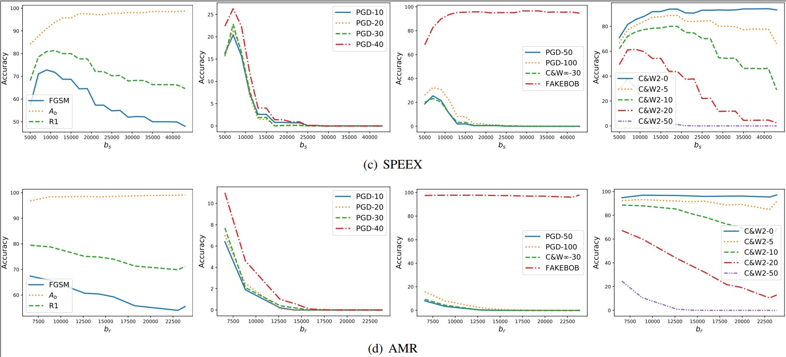
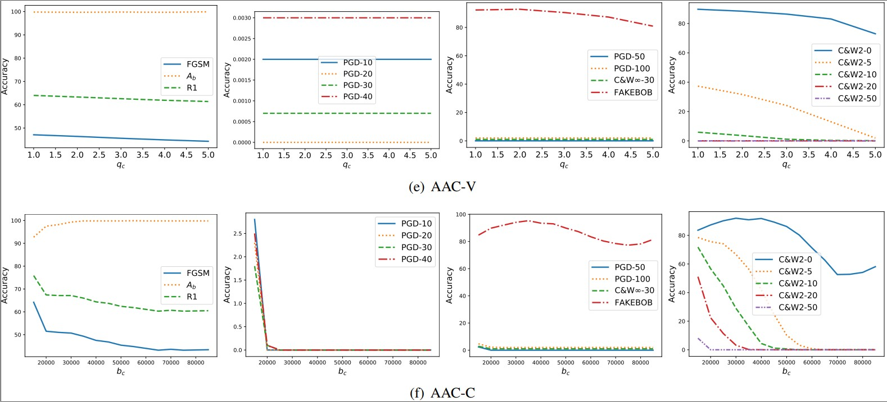
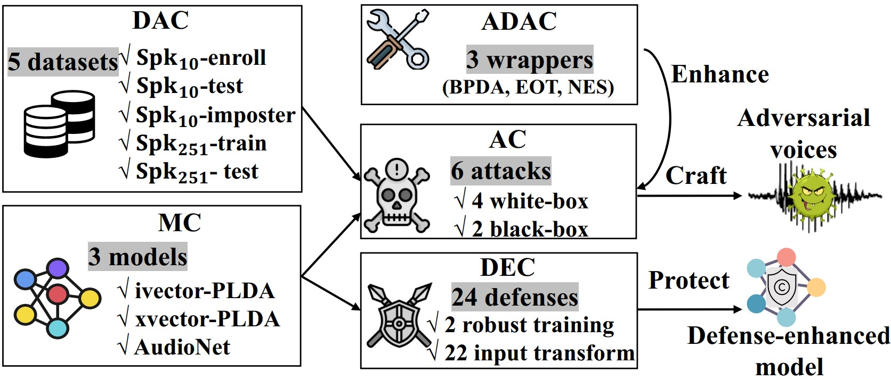

<!-- # SEC4SR
## A SECurity analysis platform for Speaker Recognition
### under construction. stay tuned! :)  -->

# About
This is the official webpage for paper ***Defending against Audio Adversarial Examples on Speaker Recognition Systems*** 
where we make the following main contributions:
- We perform the largest-scale evaluation of defenses against adversarial attacks in the speaker recognition
domain, involving **23** defenses and **15** attacks. Our study provides lots of useful insights and findings that could advance research on adversarial examples in this domain and assist the maintainers of SRSs to deploy suitable defense solutions to enhance their systems.
- We propose a new type of feature-level transformations
dedicated for speaker recognition, called **Feature Compression** (**FeCo**). Though it solely cannot defeat white-box adaptive attacks, it is effective against black-box adaptive attacks and definitely enhances the robustness of adversarially trained models against white-box adaptive attacks.
- We develop **SEC4SR**, the first platform for systematic
and comprehensive evaluation of different adversarial
attacks and defenses in the speaker recognition domain. It features mainstream SRSs, proper voice datasets, white-box and black-box attacks, techniques for mounting adaptive attacks, evaluation metrics and diverse defense solutions. We release our platform to foster further research in this direction.

# Empirical Study Result
## Transformation against Non-adaptive Attacks

    
     
    

## Transformation against Adaptive Attacks

    
     
    

## Transformation+Adversarial-Training against Adaptive Attacks

    
     
    

# Additional Results (not appear in the paper)
## *Tuning the Parameters of Transformations* in Appendix B

    
     
    

    
     
    

    
     
    

    
     
    

    
     
    

    
     
    

# Platform: SEC4SR
Want to re-produce our experimental results, do something new with our platform or even extend SEC4SR? 
Go to [Code for SEC4SR](https://github.com/SEC4SR/SEC4SR) for detailed instructions.

    
     
    
Overview of SEC4SR

